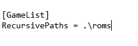
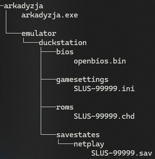

<h1>This repository has one goal. Create a savestates database for Arkadyzja!</h1>

Savestates for [Arkadyzja][1] are created in almost the same way as those for use by Fightcade - with the main difference being that the emulator uses [OpenBIOS from PCSX-Redux Team (version 20240109)][2] .

Therefore, let me quote the requirements from [HeatXD repository][3], marking the difference with **bold font**. 

By the way, if you have a useful save, I strongly recommend you to also support a [Fightcade repository][3]!

<h2>Requirements</h2>

* Use the latest revision of the game for the savestate **(if there is a valid reason to do otherwise - describe it)**.
* Both controllers need to be enabled, on digital mode (NOT analog).
* the game used to create the savestate has to be in the CHD file format **(and its filename must be named "GAME-ID000.chd")**.
* the game has to be located in a folder called "ROMs" which is in the same directory as the duckstation executable this can be done like this in your settings.ini file.

* There can only be one recursive path entry. Duckstation will automatically generate this .ini file on first launch. **Check** ~~Edit~~ it AFTER you launch for the first time, and remove/replace any prior entries for `RecursivePaths` **if necessary**.

* Savestates MUST be created with the ~~SCPH-7000W~~ **[OpenBIOS (version 20240109)][2]**.

* A [MD5 file hash][4] of the game should be supplied within the ~~Issue~~ **README.md file in the right savestate folder**. //The MD5 hash should refer to BIN files, and the information about the CHD file should include the so-called **DATA SHA1** hash. (.\chdman -i <filename>)//

* Savestates should be verified to be working on the current ~~fightcade~~ **[Arkadyzja][1]** build.

* if a savestate requires cheats to make it complete please supply the savestate with the accompanying cheat file within ~~the Issue~~ savestate folder.

* A fitting description of the savestate. what does it unlock? at which screen does it start? etc.

<h2>An example of a correct directory tree with the location of savestates, bios, and the game itself</h2>

Any questions? Official Discord channel and support: [Honmaru][5]

[1]: https://www.honmaru.pl/en/arkadyzja/
[2]: https://github.com/grumpycoders/pcsx-redux/tree/main/src/mips/openbios
[3]: https://github.com/HeatXD/duckstation-fightcade-savestates
[4]: https://emn178.github.io/online-tools/md5_checksum.html
[5]: https://honmaru.pl/arkadyzja/discord/